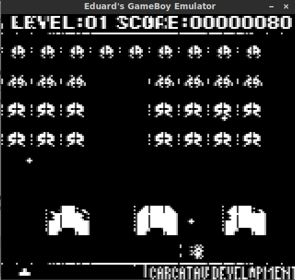

# Java Game Boy Emulator

<b>About</b>

This is a Game Boy emulator written in Java that I have been working on. At the time of updating this readme, it still lacks some features (other cartrige banking modes, sound, sprite flags, windows scrolling, some of the interrupts, etc) as well as has a couple of glitches and bugs that still need to be resolved. However, in this version nearly all the core features are implemented and various smaller games are now "playable"

<b>Some screenshots of the emulator in action: (Taken on 20/09/15)</b>

 

<b>Controls</b>
 
A - A
 
B - S
 
Start - Space
 
Select - Enter
 
Directional Buttons - Arrow Keys

<b>Selecting ROMs</b>
 
Only possible by modifying code at the moment (Main.java)
